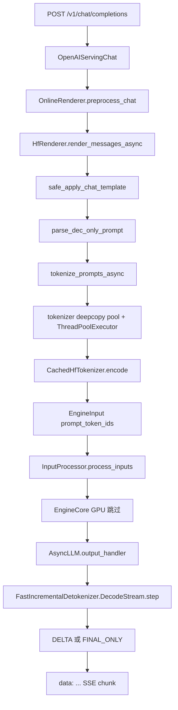

# vLLM Tokenizer 调用链

对照 `third_party/vllm` @ `2c7d7dd64a2eaba0feedf42cab2f527486d7479c`。

只跟**一条** Chat Completions 请求：

`HTTP messages → chat template → encode →（跳过 GPU）→ FastIncrementalDetokenizer → SSE stream`

调度、CUDA Graph、KV cache、attention backend 一律不看。

## 路径对照（计划 vs 本树）

| 计划路径 | 本树实际位置 |
| --- | --- |
| `vllm/tokenizers/registry.py` | 不变 |
| `vllm/tokenizers/hf.py` | 不变 |
| `vllm/renderers/hf.py` | 不变 |
| `vllm/inputs/preprocess.py` | **已迁到** `vllm/renderers/inputs/preprocess.py` |
| `vllm/v1/engine/detokenizer.py` | 不变 |
| `vllm/v1/engine/output_processor.py` | 不变 |
| `vllm/tokenizers/fastokens.py` | 不变 |

`--tokenizer-backend fastokens` **不存在**。本 commit 用环境变量 `VLLM_USE_FASTOKENS=1`（或 `--tokenizer-mode` 里任何会加载 HF fast tokenizer 的 mode + 该 env）。

## 该打开的文件

按请求方向从外到内：

1. `vllm/entrypoints/openai/chat_completion/api_router.py` — HTTP 入口
2. `vllm/entrypoints/openai/chat_completion/serving.py` — `create_chat_completion` / SSE
3. `vllm/renderers/online_renderer.py` — OnlineRenderer 把 JSON 收成 ChatParams
4. `vllm/renderers/hf.py` — Jinja chat template + `safe_apply_chat_template`
5. `vllm/renderers/base.py` — `ThreadPoolExecutor`、tokenize、`render_chat_async`
6. `vllm/renderers/inputs/preprocess.py` — `parse_dec_only_prompt`（字符串 / token ids 归一化）
7. `vllm/tokenizers/registry.py` — `get_tokenizer` / `cached_tokenizer_from_config`
8. `vllm/tokenizers/hf.py` — `get_cached_tokenizer`、`maybe_make_thread_pool`
9. `vllm/v1/engine/input_processor.py` — EngineInput → `EngineCoreRequest`
10. `vllm/v1/engine/detokenizer.py` — `FastIncrementalDetokenizer`
11. `vllm/v1/engine/output_processor.py` — `stream_interval` / DELTA / FINAL_ONLY
12. `vllm/tokenizers/fastokens.py` — 可选更快 BPE 后端

## 一条请求的全链路



vLLM 近年把 tokenizer 从「engine 里直接 encode」收成三层：

- **Renderer**：模板、工具、多模态 placeholder、tokenize（API 进程，线程池）
- **EngineCore**：只吃 `prompt_token_ids`（GPU 进程）
- **OutputProcessor**：增量 detokenize + 按 `output_kind` 组 chunk（API 进程）

Tokenizer 对象本身只做 encode / decode / `apply_chat_template`。真正把一次请求串起来的是 Renderer 和 Detokenizer：

| 层 | 入口 | 干什么 | 不干什么 |
| --- | --- | --- | --- |
| Tokenizer | `vllm/tokenizers` | `CachedHfTokenizer`：encode / decode / 模板；缓存 vocab；fast tokenizer 做 deepcopy 池 | 不管 chat 格式、截断策略、MM、stop string |
| Renderer | `renderers/base.py` + `hf.py` | API 输入 → `EngineInput`：Jinja、tokenize、padding/truncation、MM placeholder | 不跑模型，不把生成 token 转成文本 |
| Detokenizer | `v1/engine/detokenizer.py` | 每个新 token 增量 decode；检查 stop string；控制 streaming 缓冲 | 不 tokenize prompt；GPU 侧不可见 |

`BaseRenderer` 把「tokenize」扩成四步（`render_cmpl` / `render_chat`）：

1. **Render**：`render_messages` / `render_prompt`。Chat 走 Jinja 得到 `str` 或 `list[int]`；Completion 原样透传。
2. **Tokenize**：已有 `prompt_token_ids` 则跳过。否则 `apply_pre_tokenization` → `tokenizer()` → `apply_post_tokenization`。
3. **Extras**：`prompt_extras` 合进目标 prompt。
4. **Engine input**：有 `multi_modal_data` 走 MM processor；纯 embeds 走 `_process_embeds`；否则 `tokens_input`。

---

## 1. HTTP：messages 进门

```41:79:third_party/vllm/vllm/entrypoints/openai/chat_completion/api_router.py
@router.post(
    "/v1/chat/completions",
    ...
)
async def create_chat_completion(request: ChatCompletionRequest, raw_request: Request):
    ...
    generator = await handler.create_chat_completion(request, raw_request)
    ...
    return StreamingResponse(
        content=with_sse_keep_alive(generator, float(keep_alive_interval)),
        media_type="text/event-stream",
    )
```

`stream=true` 走 SSE；`stream=false` 返回一整份 JSON。

`OpenAIServingChat._create_chat_completion` 先 `render_chat_request`，再 `engine_client.generate`：

```244:405:third_party/vllm/vllm/entrypoints/openai/chat_completion/serving.py
async def create_chat_completion(...) -> ...:
    ...
    result = await self.render_chat_request(request)
    conversation, engine_inputs = result
    ...
    generator = self.engine_client.generate(engine_input, sampling_params, ...)
    if request.stream:
        return self.chat_completion_stream_generator(...)
    return await self.chat_completion_full_generator(...)
```

`stream` 直接决定 engine 侧的 `output_kind`：

```738:741:third_party/vllm/vllm/entrypoints/openai/chat_completion/protocol.py
            output_kind=(
                RequestOutputKind.DELTA if self.stream else RequestOutputKind.FINAL_ONLY
            ),
```

---

## 2. Renderer：chat template 在这里，不在 tokenizer 模块

`OnlineRenderer.preprocess_chat` 是 HTTP JSON → `EngineInput` 的枢纽。对 HF tokenizer，默认 **`tokenize=False`**：先渲染字符串，再单独 encode。只有 Mistral tokenizer 或 `enable_prompt_embeds` 才让 `apply_chat_template(tokenize=True)` 一次出 ids。

```395:436:third_party/vllm/vllm/renderers/online_renderer.py
        default_template_kwargs = merge_kwargs(
            default_template_kwargs,
            dict(
                tools=tool_dicts,
                tokenize=(
                    is_mistral_tokenizer(renderer.tokenizer)
                    or self.model_config.enable_prompt_embeds
                ),
            ),
        )
        ...
            (conversation,), (engine_input,) = await renderer.render_chat_async(
                [messages],
                chat_params,
                tok_params,
                ...
            )
```

`HfRenderer.render_messages` 做三件事，都和 BPE 解耦：

1. `parse_chat_messages`：把 OpenAI messages / 多模态拆成 conversation
2. `safe_apply_chat_template`：Jinja 模板、tools、developer→system
3. `parse_dec_only_prompt`：字符串 → `TextPrompt`，或 `list[int]` → `TokensPrompt`

```706:801:third_party/vllm/vllm/renderers/hf.py
def safe_apply_chat_template(..., tokenize: bool = True, ...):
    chat_template = resolve_chat_template(...)
    ...
    plain = tokenizer.apply_chat_template(
        conversation=conversation,
        tools=tools,
        chat_template=chat_template,
        tokenize=tokenize,
        **resolved_kwargs,
    )
```

模板解析优先级在 `resolve_chat_template`：请求传入的模板 → Processor 模板（**有 tools 时跳过**，避免和 tool-calling 模板冲突）→ Tokenizer 模板 → vLLM 预置 fallback。这是请求预处理，不是 vocab 操作。

`safe_apply_chat_template` 还有几处容易漏掉的兼容逻辑：

- **content format** 不是靠模型名猜的。`--chat-template-content-format auto` 时解析 Jinja AST：若存在 `for item in message['content']` 这类循环则为 `openai`（多段 content），否则 `string`。

```431:449:third_party/vllm/vllm/renderers/hf.py
def _detect_content_format(chat_template: str, *, default: ...):
    ...
    try:
        next(_iter_nodes_assign_content_item(jinja_ast))
    except StopIteration:
        return "string"
    else:
        return "openai"
```

- **developer 角色**：模板里没有 `"developer"` 时，把 developer 消息改成 system，并合并成第一条（Qwen 3.6 这类「system 必须在最前」的模板）。
- **transformers v5**：`apply_chat_template(tokenize=True)` 默认 `return_dict=True`，会返回 `BatchEncoding`。vLLM 强制 `return_dict=False`，保证下游 `parse_dec_only_prompt` 拿到 `list[int]`。
- 模板含 `` 且请求 `return_assistant_tokens_mask` 时，额外拿 assistant mask（SFT / 续写）。

`render_chat` / `render_chat_async` 把「渲染」和「tokenize」拆成两步：

```1030:1104:third_party/vllm/vllm/renderers/base.py
    def render_chat(...):
        rendered = [self.render_messages(...) for conversation in conversations]
        ...
        tok_prompts = self.tokenize_prompts(dict_prompts, tok_params)
        ...
        return out_conversations, eng_prompts

    async def render_chat_async(...):
        rendered = [self.render_messages_async(...) ...]
        tok_prompts = await self.tokenize_prompts_async(...)
```

### 为什么 chat template 在 Renderer 而不是 tokenizer？

- **模板、工具、多模态 placeholder 属于请求形状**，和「这段 UTF-8 怎么切成 BPE」不是同一层。
- 不同模型可以共用 `CachedHfTokenizer`，但换 Renderer：`kimi_k3` / `inkling` / `cohere` / `mistral` 都是「HF tokenizer + 另一套渲染」。registry 注释写得很直白：

```42:55:third_party/vllm/vllm/tokenizers/registry.py
    # ``cohere`` mode uses the standard cached HF tokenizer; only the
    # renderer (template stage) is replaced with a melody-based one.
    ...
    # Inkling uses the plain HF tokenizer for token operations; the "inkling"
    # mode exists to select the InklingRenderer, which renders chat to
    # token ids natively (Inkling has no Jinja chat template).
```

- 异步路径必须把 **Jinja + encode** 丢出 asyncio 主循环。`HfRenderer` 把 `safe_apply_chat_template` 绑到 renderer 线程池：

```922:929:third_party/vllm/vllm/renderers/hf.py
        self._apply_chat_template_async = make_async(
            safe_apply_chat_template, executor=self._executor
        )
        if self.tokenizer is not None:
            maybe_make_thread_pool(
                self.tokenizer, config.model_config.renderer_num_workers + 1
            )
```

`make_async` 就是 `loop.run_in_executor`：

```28:45:third_party/vllm/vllm/utils/async_utils.py
def make_async(func, executor=None):
    """Take a blocking function, and run it on in an executor thread.
    This function prevents the blocking function from blocking the
    asyncio event loop.
    """
```

---

## 3. Encode：字符串变成 `prompt_token_ids`

`parse_dec_only_prompt` 把 `apply_chat_template` 的返回值标准化：

```132:160:third_party/vllm/vllm/renderers/inputs/preprocess.py
def parse_dec_only_prompt(prompt: PromptType | object) -> DecoderOnlyDictPrompt:
    if isinstance(prompt, str):
        return TextPrompt(prompt=prompt)
    if isinstance(prompt, list):
        return TokensPrompt(prompt_token_ids=prompt)
    if isinstance(prompt, dict):
        if "prompt" in prompt or "prompt_token_ids" in prompt or "prompt_embeds" in prompt:
            return prompt
```

真正的 BPE 在 `BaseRenderer._tokenize_prompt`：调用 tokenizer 的 `__call__`（走 pool 里的 `encode`）：

```472:487:third_party/vllm/vllm/renderers/base.py
    def _tokenize_prompt(self, prompt: TextPrompt, params: TokenizeParams) -> TokensPrompt:
        tokenizer = self.get_tokenizer()
        ...
        encoding = tokenizer(prompt["prompt"], **kwargs)
        return self._build_tokens_prompt(encoding["input_ids"], prompt, ...)
```

若请求已经带 `prompt_token_ids`，`_tokenize_singleton_prompt` **跳过 encode**：

```516:536:third_party/vllm/vllm/renderers/base.py
        if "prompt_token_ids" not in prompt and "prompt_embeds" not in prompt:
            ...
            prompt = self._tokenize_prompt(prompt, params)
```

然后 `process_for_engine` 产出 `EngineInput`（`type="token"`，核心字段是 `prompt_token_ids`）。`InputProcessor.process_inputs` 只做校验、补 `max_tokens`、打包 `EngineCoreRequest`，**不再 tokenize**：

```309:434:third_party/vllm/vllm/v1/engine/input_processor.py
        if isinstance(prompt, dict) and "type" in prompt:
            engine_input: EngineInput = prompt
        else:
            # deprecated: 原始文本会再走 Renderer.render_cmpl
            (engine_input,) = renderer.render_cmpl(...)
        ...
        return EngineCoreRequest(
            request_id=request_id,
            prompt_token_ids=prompt_token_ids,
            ...
        )
```

HTTP 热路径已经先 `render_chat_async`，所以 `AsyncLLM.add_request` 看到的是带 `type` 的 EngineInput，走同步 `process_inputs`（不再堵 event loop）：

```355:375:third_party/vllm/vllm/v1/engine/async_llm.py
            if isinstance(prompt, dict) and "type" in prompt:
                request = self.input_processor.process_inputs(...)
            else:
                # Raw prompts ... must not block the event loop.
                request = await self.input_processor.process_inputs_async(...)
```

`process_inputs_async` 本身也绑在 renderer 线程池上：

```70:75:third_party/vllm/vllm/v1/engine/input_processor.py
        self.process_inputs_async = make_async(
            self.process_inputs, executor=self.renderer._executor
        )
```

### TokenizeParams：encode 前后两层防护

真正调用 `tokenizer()` 前后，`TokenizeParams` 各做一次校验，避免无界 tokenize 和超长 prompt。

Chat / Completion **默认不一样**：

```351:370:third_party/vllm/vllm/renderers/base.py
        return TokenizeParams(
            ...
            add_special_tokens=True,   # default_cmpl_tok_params
        )
        ...
        return TokenizeParams(
            ...
            add_special_tokens=False,  # default_chat_tok_params：模板已经写过 BOS/EOS
        )
```

| 阶段 | 动作 |
| --- | --- |
| pre（`apply_pre_tokenization`） | 字符级长度上界（`max_chars_per_token × max_input_tokens`）；可选 lower case |
| encode（`get_encode_kwargs`） | `truncation` / `max_length` / `add_special_tokens`；fast tokenizer 可要 `offset_mapping` |
| post（`apply_post_tokenization`） | pad、按 `truncation_side` 切片、超过 `max_input_tokens` 报 `VLLMValidationError` |

指定了 `truncation_side` 时会 **关掉 tokenizer 自带 truncation**，改在 Python 侧切片，避免 HF 默认方向和请求不一致。`offset_mapping` 只在 **fast tokenizer + 纯文本、无 MM** 时开启。

---

## 4. 加载：`get_tokenizer` → CachedTokenizer

启动时 `renderer_from_config` 调 `cached_tokenizer_from_config`：

```82:88:third_party/vllm/vllm/renderers/registry.py
def renderer_from_config(config, **kwargs):
    tokenizer = cached_tokenizer_from_config(model_config, **kwargs)
    renderer_mode, *_ = tokenizer_args_from_config(model_config, **kwargs)
    return RENDERER_REGISTRY.load_renderer(renderer_mode, config, tokenizer)
```

```270:283:third_party/vllm/vllm/tokenizers/registry.py
def cached_tokenizer_from_config(model_config, **kwargs):
    if model_config.skip_tokenizer_init:
        return None
    return cached_get_tokenizer(...)
```

`get_tokenizer` 解析 mode（`auto` → mistral 探测 → 否则 `hf`），可选打上 fastokens patch，再 `CachedHfTokenizer.from_pretrained`：

```186:264:third_party/vllm/vllm/tokenizers/registry.py
def get_tokenizer(...) -> _T:
    if envs.VLLM_USE_FASTOKENS:
        from .fastokens import apply_fastokens_patch
        apply_fastokens_patch()
    ...
    tokenizer = tokenizer_cls_.from_pretrained(...)
    if not tokenizer.is_fast:
        logger.warning("Using a slow tokenizer. This might cause a significant slowdown.")
```

`CachedHfTokenizer.from_pretrained` 最后一定包一层 `get_cached_tokenizer`。

---

## 设计点 1：为什么要 CachedTokenizer

HF tokenizer 的若干属性（`all_special_ids`、`get_vocab()`、`__len__`）**每次访问都会重算**。serving 热路径上 stop 检查、vocab 校验、`max_chars_per_token` 预估都会反复碰到它们。

```107:195:third_party/vllm/vllm/tokenizers/hf.py
def get_cached_tokenizer(tokenizer: HfTokenizer) -> HfTokenizer:
    """
    By default, transformers will recompute multiple tokenizer properties
    each time they are called, leading to a significant slowdown.
    This proxy caches these properties for faster access.
    """
    tokenizer_all_special_ids = tokenizer.all_special_ids
    tokenizer_all_special_tokens = tokenizer.all_special_tokens
    tokenizer_vocab = tokenizer.get_vocab()
    tokenizer_len = len(tokenizer)
    ...
    class CachedTokenizer(tokenizer.__class__):
        @property
        def all_special_ids(self) -> list[int]:
            return tokenizer_all_special_ids
        ...
        def get_vocab(self) -> dict[str, int]:
            return tokenizer_vocab
        def __len__(self) -> int:
            return tokenizer_len
```

同时缓存 `max_token_id` / `max_chars_per_token`：前者给 `InputProcessor` 做 vocab 越界检查，后者给 `TokenizeParams._text_len_check` 在 encode 前按字符数粗切，避免超长 prompt 把 tokenizer 打爆。

这是 **O(1) 属性缓存**，不是 LRU 结果缓存。`cached_get_tokenizer` 的 `lru_cache` 是「同一组 from_pretrained 参数不要重复加载」，另一层。

---

## 设计点 2：tokenizer pool / `Already borrowed`

HF **fast** tokenizer 的内部是 Rust `tokenizers` crate，Python 绑定用 `RefCell`。同一实例被两个线程同时 `encode` / `apply_chat_template` / `decode`，会炸：

```text
RuntimeError: Already borrowed
```

本仓库测试里直接写了这句注释：

```47:48:third_party/vllm/tests/models/multimodal/processing/test_llava_onevision.py
    # Avoid tokenizer already borrowed error
    maybe_make_thread_pool(ctx.tokenizer)
```

vLLM 的修法是 **深拷贝一份 tokenizer 池**，公共方法从 `queue.Queue` 里借出再用还。只对 `TokenizersBackend`（fast）动手；slow / Python tokenizer 没有这层 RefCell。

```25:104:third_party/vllm/vllm/tokenizers/hf.py
def maybe_make_thread_pool(tokenizer, copies: int = 1):
    """
    If `tokenizer` is a `TokenizersBackend`, modify the tokenizer
    in-place to make the public interface thread-safe by routing calls
    through a deep-copied tokenizer pool.
    """
    tokenizer_pool: queue.Queue[TokenizersBackend] = queue.Queue()
    for _ in range(copies):
        tokenizer_pool.put(copy.deepcopy(og_tokenizer))

    def _borrow_from_pool():
        try:
            tok = tokenizer_pool.get_nowait()
            yield tok
        except queue.Empty:
            tok = copy.deepcopy(og_tokenizer)  # 池空则再拷一份
            yield tok
        finally:
            tokenizer_pool.put(tok)

    class TokenizerPool(...):
        def encode(self, *args, **kwargs):
            with _borrow_from_pool() as tok:
                return tok.encode(*args, **kwargs)
        def apply_chat_template(...): ...
        def decode(...): ...
```

注意三套「池」，别混：

| 池 | 解决什么 | 在哪 |
| --- | --- | --- |
| `_executor`：`ThreadPoolExecutor(max_workers=renderer_num_workers)` | 阻塞的 Jinja/encode/decode 不堵 asyncio | `BaseRenderer.__init__` |
| `_mm_executor`：`ThreadPoolExecutor(max_workers=1)` | MM 预处理不插队 tokenize（P0/P1 顺序，见 #38418） | `BaseRenderer.__init__` |
| `maybe_make_thread_pool(..., copies=workers+1)` | 多线程不共享同一个 Rust `RefCell` | `HfRenderer.__init__` |

```82:90:third_party/vllm/vllm/renderers/base.py
        pool_workers = config.model_config.renderer_num_workers
        self._executor = ThreadPoolExecutor(max_workers=pool_workers)

        # Separate single-worker executor so tokenization never queues behind
        # MM preprocessing; must stay single-worker per #38418 (P0/P1 order).
        self._mm_executor: Executor = ThreadPoolExecutor(max_workers=1)
```

`copies = renderer_num_workers + 1`：线程池 N 个 worker 并发 encode，再加一份给可能的同步路径。池空时 `deepcopy` 兜底，正确但不免费。

`--renderer-num-workers` 只影响 **async renderer**（`vllm serve`）。离线 `LLM.generate` 走同步路径，这个参数无效。

**局限**：pool 只保证 `TokenizerLike` 的公共接口线程安全。`_tokenizer`（给 `DecodeStream` 用的底层 Rust 对象）和 `add_special_tokens` 不在保护范围内。所以 detokenizer 用的是 **另一份** `tokenizer._tokenizer`，见下一节。

---

## 5. 下游：FastIncrementalDetokenizer（跳过 GPU 之后）

`AsyncLLM` 启动时 OutputProcessor 拿的是 **同一个 renderer.tokenizer**：

```135:146:third_party/vllm/vllm/v1/engine/async_llm.py
        self.renderer = renderer = renderer_from_config(self.vllm_config)
        self.input_processor = InputProcessor(self.vllm_config, renderer)
        self.output_processor = OutputProcessor(
            renderer.tokenizer,
            stream_interval=self.vllm_config.scheduler_config.stream_interval,
            ...
        )
```

每个新请求建一个 detokenizer：

```50:66:third_party/vllm/vllm/v1/engine/detokenizer.py
        if tokenizer is None:
            return IncrementalDetokenizer()  # 只攒 token ids，不解码
        if USE_FAST_DETOKENIZER and isinstance(tokenizer, TokenizersBackend):
            return FastIncrementalDetokenizer(tokenizer, request)
        return SlowIncrementalDetokenizer(tokenizer, request)
```

`USE_FAST_DETOKENIZER` 要求 `tokenizers >= 0.22.0`（`DecodeStream` 支持用 prompt ids 做 native prefill）。

```168:248:third_party/vllm/vllm/v1/engine/detokenizer.py
class FastIncrementalDetokenizer(BaseIncrementalDetokenizer):
    def __init__(...):
        self.tokenizer: Tokenizer = tokenizer._tokenizer  # 底层 Rust，不走 Python pool
        # Look up DecodeStream on the module so backend patches (e.g. the
        # fastokens shim that replaces ``tokenizers.decoders.DecodeStream``)
        # are honored regardless of import order.
        self.stream = tokenizers.decoders.DecodeStream(
            ids=request.prompt_token_ids,
            skip_special_tokens=self.skip_special_tokens,
        )

    def decode_next(self, next_token_id: int) -> str:
        token = self._protected_step(next_token_id)
        ...
        return token or ""

    def _protected_step(self, next_token_id: int) -> str | None:
        token = self.stream.step(self.tokenizer, next_token_id)
```

要点：

1. **增量**：每个新 token 调 `DecodeStream.step`，不把整段 `output_token_ids` 再 `decode` 一遍。
2. **用 prompt ids 预热**，才能正确处理跨 prompt/生成边界的 UTF-8 / BPE 续写。
3. **按模块名查找 `DecodeStream`**，这样 `fastokens.patch_transformers()` 替换的是 `tokenizers.decoders.DecodeStream`，不依赖 import 顺序。
4. 遇到 `Invalid prefix encountered` 会重建 stream（非单调 UTF-8 会弄坏 DecodeStream 内部状态）。

`BaseIncrementalDetokenizer.update` 每步：detokenize → 匹配 stop string → 按 `include_stop_str_in_output` 截断。stop **字符串**匹配发生在 Python 文本上，比 token-id stop 贵。

`get_next_output_text(finished, delta)`：

- `delta=True`：只返回自上次调用以来的新字符（SSE 用这个）
- `delta=False`：返回目前全部 `output_text`（可能扣掉 stop 缓冲）
- 未 finished 时会按最长 stop 串留 `stop_buffer_length` 个字符，避免把半截 stop 流出去

### Slow 路径（`tokenizers < 0.22` 或 slow tokenizer）

Fast 不可用时退回 `SlowIncrementalDetokenizer`：经典 prefix / read offset（来自 TGI）。prompt **只转末尾约 7 个 token** 成字符串（`INITIAL_INCREMENTAL_DETOKENIZATION_OFFSET = 5` 再多 2 个 special）：

```176:268:third_party/vllm/vllm/tokenizers/detokenizer_utils.py
def detokenize_incrementally(...):
    ...
    prefix_text = tokenizer.convert_tokens_to_string(
        output_tokens[prefix_offset:read_offset]
    )
    new_text = tokenizer.convert_tokens_to_string(output_tokens[prefix_offset:])
    if len(new_text) <= len(prefix_text) or new_text.endswith("�"):
        return new_tokens, "", prefix_offset, read_offset
    new_text = new_text[len(prefix_text) :]
```

offset 是为了对付 SentencePiece / BPE「周围 token 决定要不要加空格」。若新文本变短，或结尾是 `�`（未完成的 UTF-8 byte fallback），这次不吐字，等下一个 token。

Slow 会把 prompt ids 也放进 `token_ids`，`output_token_ids` 再切掉 prompt 部分。Fast 只累积生成 ids。

Stop string 在 `update()` 里、decode 之后做字符串匹配：投机解码一次追加多个 token 时，选 **最先完成** 的 stop（并列按 stop 列表顺序），保证和逐 token 追加结果一致。`min_tokens` 之内不检查 stop。engine 已经因 EOS 停了、且不要把 stop token 写进输出时：最后一个 token 先不 decode，再补回 `token_ids`。

---

## 设计点 3：`stream_interval` / DELTA vs FINAL_ONLY

```198:204:third_party/vllm/vllm/sampling_params.py
class RequestOutputKind(Enum):
    CUMULATIVE = 0   # 每次返回目前全部文本
    DELTA = 1        # 每次只返回增量
    FINAL_ONLY = 2   # 生成结束才返回
```

Chat Completions：`stream=true` → `DELTA`；`stream=false` → `FINAL_ONLY`。

`OutputProcessor.process_outputs` 是 V1 里**唯一**遍历整批 `EngineCoreOutput` 的 Python 循环：

```673:706:third_party/vllm/vllm/v1/engine/output_processor.py
                stop_string = req_state.detokenizer.update(
                    new_token_ids, finish_reason == FinishReason.STOP
                )
                ...
                if request_output := req_state.make_request_output(...):
                    if req_state.queue is not None:
                        req_state.queue.put(request_output)
```

`make_request_output` 决定**这一步要不要对客户端吐 chunk**：

```292:320:third_party/vllm/vllm/v1/engine/output_processor.py
        finished = finish_reason is not None
        final_only = self.output_kind == RequestOutputKind.FINAL_ONLY
        if not finished and final_only:
            return None  # 非流式：中间步全部吞掉，detokenize 仍在跑

        if self.stream_interval > 1:
            if not (finished or first_token or tokens_since_last >= stream_interval):
                return None
            if self.output_kind == RequestOutputKind.DELTA:
                new_token_ids = self.detokenizer.output_token_ids[self.sent_tokens_offset:]
```

`stream_interval` 来源：

- engine 级 `--stream-interval`（`SchedulerConfig.stream_interval`，默认 1）
- 请求级 `ChatCompletionRequest.stream_interval`，**只能抬高、不能压过** engine 值：

```234:236:third_party/vllm/vllm/v1/engine/output_processor.py
            if sampling_params.stream_interval is not None:
                stream_interval = max(sampling_params.stream_interval, stream_interval)
```

含义：每攒 N 个新 token 才组一个 `RequestOutput`。`=1` 最平滑；`>1` 少 Python↔Rust 往返和 SSE 次数，ITL 可能出现周期性尖峰。首 token 和最终 chunk **总是立刻发**。

DELTA 时文本取增量：

```403:407:third_party/vllm/vllm/v1/engine/output_processor.py
        delta = self.output_kind == RequestOutputKind.DELTA
        text = self.detokenizer.get_next_output_text(finished, delta)
```

后台 `output_handler` 从 EngineCore 拉 ids，推进 detokenizer，把 `RequestOutput` 推进每个请求的 queue；`generate()` 再 yield 给 serving 层：

```666:708:third_party/vllm/vllm/v1/engine/async_llm.py
        async def output_handler():
            while True:
                outputs = await engine_core.get_output_async()
                processed_outputs = output_processor.process_outputs(...)
                # RequestOutputs are pushed to their queues.
```

```602:615:third_party/vllm/vllm/v1/engine/async_llm.py
            while not finished:
                out = q.get_nowait() or await q.get()
                finished = out.finished
                yield out
```

SSE 层几乎不再 decode，直接用 `output.text`：

```645:670:third_party/vllm/vllm/entrypoints/openai/chat_completion/serving.py
                    delta_text = output.text
                    ...
                    else:
                        delta_message = DeltaMessage(content=delta_text)
                    yield f"data: {chunk.model_dump_json(...)}\n\n"
```

`FINAL_ONLY` 仍然逐步 `detokenizer.update`（stop string 依赖文本），只是不把中间 `RequestOutput` 交给客户端。

---

## 设计点 4：`skip_tokenizer_init` + `prompt_token_ids`

```287:290:third_party/vllm/vllm/config/model.py
    skip_tokenizer_init: bool = False
    """Skip initialization of tokenizer and detokenizer. Expects valid
    `prompt_token_ids` and `None` for prompt from the input. The generated
    output will contain token ids."""
```

效果：

1. `cached_tokenizer_from_config` 返回 `None` → `Renderer.tokenizer is None`
2. `get_tokenizer()` 立刻报错：`Tokenizer not available when skip_tokenizer_init=True`
3. 文本 prompt / chat template **不可用**；必须自己把 ids 送进来
4. detokenizer 退化成空实现，`CompletionOutput.text == ""`，只有 `token_ids`

测试把契约写死了：

```217:238:third_party/vllm/tests/v1/engine/test_llm_engine.py
    llm = LLM(model=model, skip_tokenizer_init=True, ...)
    with pytest.raises(ValueError, match="`skip_tokenizer_init=True`"):
        llm.generate("abc", sampling_params)
    outputs = llm.generate({"prompt_token_ids": [1, 2, 3]}, ...)
    assert completions[0].text == ""
    assert completions[0].token_ids
```

`--tokens-only` 会强制打开这个开关（内部 token-in / token-out 通路）：

```2265:2267:third_party/vllm/vllm/engine/arg_utils.py
        if self.tokens_only and not model_config.skip_tokenizer_init:
            model_config.skip_tokenizer_init = True
```

**延迟最优，代价是服务端模板一致性没了**：网关必须用和模型完全同一份 chat template + tokenizer 版本。对外 Chat Completions 仍建议服务端统一渲染；这条通路适合内部高吞吐、已经预 tokenize 的流量。

即使不 skip，只要请求里已经有 `prompt_token_ids`（Completions 的 token prompt、disagg 的 `kv_transfer_params.prompt_token_ids` 复用），Renderer 也会跳过模板和 encode。那是「跳过这一次」，不是「从不加载 tokenizer」——下游仍要 tokenizer 做增量 detokenize。

Structured outputs 依赖 tokenizer，和 `skip_tokenizer_init` 互斥。

---

## 设计点 5：fastokens 后端

```1:39:third_party/vllm/vllm/tokenizers/fastokens.py
"""When ``VLLM_USE_FASTOKENS=1`` is set, ``fastokens.patch_transformers()`` swaps
the inner Rust tokenizer of every HF fast tokenizer loaded afterwards with the
fastokens shim and rebinds ``tokenizers.decoders.DecodeStream`` so the
streaming detokenizer accepts the shim.
"""
def apply_fastokens_patch() -> None:
    ...
    fastokens.patch_transformers()
```

- 进程级、幂等；在 `get_tokenizer` **加载之前**打补丁
- 要求 `fastokens >= 0.2.0`
- 对任何最终走到 HF fast tokenizer 的 mode 生效（`hf`、`deepseek_v32`、`deepseek_v4`…）
- `mistral` / `kimi_audio` 不走 HF fast，flag 无效
- **不是** `--tokenizer-backend` CLI

`tokenizer_mode` 文档：

```162:165:third_party/vllm/vllm/config/model.py
    To swap the Rust BPE backend that powers HF fast tokenizers for the
    fastokens implementation, set `VLLM_USE_FASTOKENS=1` instead — that override
    applies to any mode that loads an HF fast tokenizer.
```

启用方式：

```bash
VLLM_USE_FASTOKENS=1 vllm serve Qwen/Qwen3-8B
```

正确性前提：同一模型 encode 结果必须与 HF fast **逐 token 对齐**。瓶颈若在 GPU prefill/decode，换 BPE 后端端到端几乎看不见。

---

## 启动时线程池有多大

```82:86:third_party/vllm/vllm/renderers/base.py
        # Thread pool executor for blocking tokenizer operations.
        pool_workers = config.model_config.renderer_num_workers
        self._executor = ThreadPoolExecutor(max_workers=pool_workers)
```

```367:376:third_party/vllm/vllm/config/model.py
    renderer_num_workers: int = 1
    """Number of worker threads in the renderer thread pool. The pool is
    consumed by the async renderer path (e.g. the OpenAI-compatible API
    server ...) to parallelize tokenization, chat template rendering, and
    multimodal preprocessing across concurrent requests.
    """
```

默认 1 已经足够「不堵 event loop」。高 QPS 长 prompt 才考虑加到 2–4；同时 `maybe_make_thread_pool` 的副本数会跟着涨。多模态 pooling + mm processor cache 时 `>1` 会被拒绝（cache 非线程安全）。

---

## 读完应能回答

1. 一次 Chat Completions 请求里，Jinja 和 BPE 分别在哪一层、默认是否 `tokenize=True` 一次完成？
2. 为什么 serving 必须 CachedTokenizer + deepcopy pool，而不是「共用一个 HF tokenizer」？
3. `Already borrowed` 是哪一层的 bug，vLLM 怎么绕开？`_executor` 和 `_mm_executor` 各防什么？
4. 为什么 chat 默认 `add_special_tokens=False`、completion 默认 `True`？`truncation_side` 为什么不交给 HF tokenizer 自己切？
5. `skip_tokenizer_init` 之后还能调 `/v1/chat/completions` 传 messages 吗？
6. `DELTA` + `stream_interval=10` 时，客户端几个 token 才看到一段文本？`FINAL_ONLY` 还会跑 DecodeStream 吗？
7. Fast / Slow detokenizer 各自怎么处理「当前 token 会改写前一个 token 的空格」？
8. `VLLM_USE_FASTOKENS=1` 换的是哪一块 Rust，和 `--tokenizer-mode` 是什么关系？

---

## 旁路：ORCA 反压头（不经过 tokenizer）

非流式 Chat / Completions 在 `JSONResponse` 上可按请求头 `endpoint-load-metrics-format` 附带 KV cache 占用和排队数。写的是 `PrometheusStatLogger` 的 Gauge，读的是进程内 `REGISTRY`，**不经过** Renderer / Detokenizer。流式 SSE 没有这个头。展开见 [06-vllm-orca.md](06-vllm-orca.md)。
