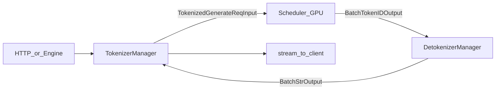

# 03 · SGLang：TokenizerManager / DetokenizerManager / 多 worker IPC

对照源码钉：`third_party/sglang` @ `e635577431cbdfb8ce5fafb0fcd8a4ac074062c6`。

SGLang 的 tokenizer 不在 GPU 进程里「顺手 encode」。默认拓扑是 **三个进程**：

1. **TokenizerManager**（与 HTTP / Engine 同进程）：chat template 之后的 text → token ids，把 `TokenizedGenerateReqInput` 推给 Scheduler。
2. **Scheduler**（子进程，本篇只点到为止）：收 ids、组 batch、前向，发出 `BatchTokenIDOutput`。
3. **DetokenizerManager**（子进程）：增量 detokenize，把 `BatchStrOutput` 推回 TokenizerManager，再流式回客户端。

进程之间走 **ZMQ IPC**（`sock_send` / `sock_recv`，默认 msgpack，可切 pickle）。不要把 CUDA graph / KV cache / attention backend 读进来。



---

## 该打开的文件

| 角色 | 路径 |
| --- | --- |
| HTTP `/generate` | `python/sglang/srt/entrypoints/http_server.py` |
| 进程启动 | `python/sglang/srt/entrypoints/engine.py` |
| Tokenizer 进程 | `python/sglang/srt/managers/tokenizer_manager.py` |
| Detokenizer 进程 | `python/sglang/srt/managers/detokenizer_manager.py` |
| IPC 消息体 | `python/sglang/srt/managers/io_struct.py` |
| ZMQ 端口名 | `python/sglang/srt/server_args.py` `PortArgs` |
| Scheduler 侧增量偏移（只看 `init_incremental_detokenize`） | `python/sglang/srt/managers/schedule_batch.py` |
| Scheduler 发出 `BatchTokenIDOutput` | `python/sglang/srt/managers/scheduler_components/output_streamer.py` |
| Scheduler 的 ZMQ 出口 | `python/sglang/srt/managers/scheduler_components/ipc_channels.py` |
| 多 tokenizer / 多 detokenizer 路由 | `python/sglang/srt/managers/multi_tokenizer_mixin.py` |
| `get_tokenizer`（真路径） | `python/sglang/srt/utils/hf_transformers/tokenizer.py` |
| 兼容 shim | `python/sglang/srt/utils/hf_transformers_utils.py` |
| OpenAI chat template | `python/sglang/srt/entrypoints/openai/serving_chat.py` |
| UTF-8 可打印前缀 | `python/sglang/utils.py` `find_printable_text` |
| CLI：`tokenizer_backend` / `tokenizer_worker_num` | `python/sglang/srt/server_args.py` |

`get_tokenizer` 曾经写在 `hf_transformers_utils.py`。当前该文件只是 re-export shim；实现在 `python/sglang/srt/utils/hf_transformers/tokenizer.py`。

---

## 0. 进程怎么起

`Engine` / `launch_server` 把三件套写死在注释里：TokenizerManager 在主进程，Scheduler 和 DetokenizerManager 各一个（或一组）子进程。

```211:223:third_party/sglang/python/sglang/srt/entrypoints/engine.py
class Engine(EngineScoreMixin, EngineBase):
    """
    The entry point to the inference engine.

    - The engine consists of three components:
        1. TokenizerManager: Tokenizes the requests and sends them to the scheduler.
        2. Scheduler (subprocess): Receives requests from the Tokenizer Manager, schedules batches, forwards them, and sends the output tokens to the Detokenizer Manager.
        3. DetokenizerManager (subprocess): Detokenizes the output tokens and sends the result back to the Tokenizer Manager.

    Note:
    1. The HTTP server, Engine, and TokenizerManager all run in the main process.
    2. Inter-process communication is done through IPC (each process uses a different port) via the ZMQ library.
    """
```

启动顺序（`_launch_subprocesses`）：先 Scheduler，再 Detokenizer，最后在 rank-0 主进程里构造 TokenizerManager。`tokenizer_worker_num == 1` 时直接 `init_tokenizer_manager`；`> 1` 时主进程只放一个 `MultiTokenizerRouter`，真正的 TokenizerWorker 由 HTTP worker 在 lifespan 里各自创建。

```1193:1201:third_party/sglang/python/sglang/srt/entrypoints/engine.py
        # Init tokenizer manager first, as the bootstrap server is initialized here
        if server_args.tokenizer_worker_num == 1:
            tokenizer_manager, template_manager = init_tokenizer_manager_func(
                server_args, port_args
            )
        else:
            # Launch multi-tokenizer router
            tokenizer_manager = MultiTokenizerRouter(server_args, port_args)
            template_manager = None
```

三条默认 IPC 名字（同机 `ipc://` 临时文件）：

```4488:4506:third_party/sglang/python/sglang/srt/server_args.py
class PortArgs:
    # The ipc filename for tokenizer to receive inputs from detokenizer (zmq)
    tokenizer_ipc_name: str
    # The ipc filename for scheduler (rank 0) to receive inputs from tokenizer (zmq)
    scheduler_input_ipc_name: str
    # The ipc filename for detokenizer to receive inputs from scheduler (zmq)
    detokenizer_ipc_name: str
    ...
    # The ipc filename for MultiTokenizerRouter to receive inputs from TokenizerWorker processes (zmq)
    tokenizer_worker_ipc_name: Optional[str]
```

单 worker 时套接字方向：

| 进程 | 套接字 | 绑定 |
| --- | --- | --- |
| TokenizerManager | PULL `tokenizer_ipc_name`（收 detok 结果）；PUSH `scheduler_input_ipc_name`（发 ids） | `tokenizer_manager.py` L553–561 |
| Scheduler rank 0 | PULL `scheduler_input_ipc_name`；PUSH `detokenizer_ipc_name`（或 skip 时直接 PUSH `tokenizer_ipc_name`） | `ipc_channels.py` L36–65 |
| DetokenizerManager | PULL `detokenizer_ipc_name`；PUSH `tokenizer_ipc_name` | `detokenizer_manager.py` L122–133 |

---

## 1. 一条请求：从客户端走进 TokenizerManager

本篇跟 **原生 `/generate` + 文本 prompt + `stream=true`**。OpenAI `/v1/chat/completions` 只是在进 TokenizerManager **之前**多做了 chat template，最后同样调用 `generate_request`。

### 1.1 HTTP

```900:941:third_party/sglang/python/sglang/srt/entrypoints/http_server.py
@app.api_route(
    "/generate",
    methods=["POST", "PUT"],
    response_class=SGLangORJSONResponse,
)
async def generate_request(obj: GenerateReqInput, request: Request):
    """Handle a generate request."""
    ...
    if obj.stream:
        async def stream_results() -> AsyncIterator[bytes]:
            try:
                async for out in _global_state.tokenizer_manager.generate_request(
                    obj, request
                ):
                    yield b"data: " + dumps_json(out) + b"\n\n"
            ...
            yield b"data: [DONE]\n\n"
        return StreamingResponse(
            stream_results(),
            media_type="text/event-stream",
            background=_global_state.tokenizer_manager.create_abort_task(obj),
        )
```

请求体是 `GenerateReqInput`：可以给 `text`，也可以直接给 `input_ids` / `input_embeds`。流式是 SSE；断连时 `create_abort_task` 后台 abort。

### 1.2 Chat template 落在哪一层

TokenizerManager **不负责** Jinja chat template。原生 `/generate` 吃的已经是字符串或 ids。

OpenAI Chat 在 **同一主进程** 的 `OpenAIServingChat` 里先渲染再 encode。当前实现故意把 `apply_chat_template(tokenize=True)` 拆成「渲染字符串 + `encode`」，避免模板里已有的 special tokens 再被 tokenizer 加一遍 BOS：

```1375:1396:third_party/sglang/python/sglang/srt/entrypoints/openai/serving_chat.py
            # Split apply_chat_template(tokenize=True) into render + encode so we
            # can skip add_special_tokens=False on tokenizers that don't auto-add
            # specials (Kimi-like, OpenAI-chat analogue of #25265). Chat
            # templates already include role/special tokens, so the encode must
            # avoid double BOS on tokenizers that would add it.
            encode_kwargs = (
                {"add_special_tokens": False}
                if self._tokenizer_auto_adds_specials
                else {}
            )
            try:
                rendered_prompt = self.tokenizer_manager.tokenizer.apply_chat_template(
                    openai_compatible_messages,
                    tokenize=False,
                    add_generation_prompt=True,
                    tools=tools,
                    return_dict=False,
                    **extra_template_kwargs,
                )
                prompt_ids = self.tokenizer_manager.tokenizer.encode(
                    rendered_prompt, **encode_kwargs
                )
```

`TemplateManager`（`python/sglang/srt/parser/template_manager.py`）管模板检测、reasoning / tool parser 建议，不跑 BPE。Chat 路径随后构造 `GenerateReqInput(input_ids=prompt_ids, ...)`，再 `tokenizer_manager.generate_request(...)`。这条路径上 TokenizerManager 的 encode 会被跳过（见下）。

### 1.3 `generate_request`：建状态 → tokenize → 发走 → 等结果

```770:823:third_party/sglang/python/sglang/srt/managers/tokenizer_manager.py
    async def generate_request(
        self,
        obj: Union[GenerateReqInput, EmbeddingReqInput],
        request: Optional[fastapi.Request] = None,
    ):
        self.auto_create_handle_loop()
        ...
        self._init_req_state(obj, request)
        try:
            ...
                if obj.is_single:
                    tokenized_obj = await self._tokenize_one_request(obj)
                    ...
                    self._send_one_request(tokenized_obj)
                    async for response in self._wait_one_response(obj, request):
                        yield response
```

要点：

- `auto_create_handle_loop` 在当前 asyncio loop 上挂一个后台任务 `handle_loop`，专门 PULL detokenizer 回来的 batch。
- `_init_req_state` 为每个 `rid` 建 `ReqState`（`asyncio.Event` + `out_list`）。HTTP handler 在 `_wait_one_response` 里 `await state.event.wait()`；真正填 `out_list` 的是 `handle_loop`。
- tokenize 失败（超长、非法 ids）会 `_discard_pending_req_states`，否则 `rid_to_state` 泄漏。

### 1.4 `_tokenize_one_request`：三种输入

```973:1000:third_party/sglang/python/sglang/srt/managers/tokenizer_manager.py
        if obj.input_embeds is not None:
            ...
            input_embeds = obj.input_embeds
            input_ids = obj.input_ids
        elif obj.input_ids is not None:
            input_ids = obj.input_ids
        else:
            if self.tokenizer is None:
                raise ValueError(
                    "The engine initialized with skip_tokenizer_init=True cannot "
                    "accept text prompts. Please provide input_ids or re-initialize "
                    "the engine with skip_tokenizer_init=False."
                )
            ...
                input_ids, token_type_ids = await self._tokenize_texts(
                    input_text, is_cross_encoder_request
                )
```

`_tokenize_texts` 先识别输入形状，再决定走哪条 encode：

| `InputFormat` | 形状 | 喂给 tokenizer 的东西 |
| --- | --- | --- |
| `SINGLE_STRING` | `"Hello"` | 包成 `[text]`，单条时可走动态攒批 |
| `BATCH_STRINGS` | `["Hello", "World"]` | 原样 batch encode |
| `CROSS_ENCODER_PAIRS` | `[["query", "doc"]]` | 原样；并打开 `return_token_type_ids` |

```889:937:third_party/sglang/python/sglang/srt/managers/tokenizer_manager.py
    async def _tokenize_texts(...):
        input_format = self._detect_input_format(texts, is_cross_encoder)
        tokenizer_input = self._prepare_tokenizer_input(texts, input_format)
        ...
        use_async_tokenizer = (
            self.async_dynamic_batch_tokenizer is not None
            and input_format == InputFormat.SINGLE_STRING
        )
        if use_async_tokenizer:
            result = await self.async_dynamic_batch_tokenizer.encode(
                tokenizer_input[0], **tokenizer_kwargs
            )
            ...
        else:
            if not is_cross_encoder and (not getattr(self.tokenizer, "is_fast", False)):
                input_ids = [self.tokenizer.encode(t) for t in tokenizer_input]
            else:
                encoded = self.tokenizer(tokenizer_input, **tokenizer_kwargs)
```

设计点：

- **slow tokenizer 不用 `__call__`**，逐条 `encode`，避开 HF slow 路径上不兼容的 kwargs。
- **`--enable-dynamic-batch-tokenizer`** 只接单字符串。并发请求进 `AsyncDynamicbatchTokenizer` 队列，在 `batch_wait_timeout_s`（默认 2ms）内攒到 `max_batch_size`，kwargs 完全一致才一次 `tokenizer(prompts, **kwargs)`；否则退回逐条。真正的 HF 调用丢进 **单线程** `ThreadPoolExecutor`，event loop 不被 GIL 堵住。
- EmbeddingGemma：checkpoint 默认加 BOS 不加 EOS。这里按条补 `eos_token_id`，不改 tokenizer 全局 post-processor。
- `--enable-tokenizer-batch-encode` 在 `_handle_batch_request` 里对一个 HTTP batch 做一次 `tokenizer(list_of_texts)`。约束：不能有多模态、不能混 `input_ids` / `input_embeds`。全是预 tokenize 的 ids 时也会 **batch 发送**（不再 encode），但 **DP attention 时关掉**，否则会全打到 rank 0。

```1541:1555:third_party/sglang/python/sglang/srt/managers/tokenizer_manager.py
    def _should_use_batch_tokenization(self, batch_size, requests) -> bool:
        return batch_size > 0 and (
            get_serving().enable_tokenizer_batch_encode
            or (
                (not get_parallel().enable_dp_attention)
                and (not self._batch_has_text(batch_size, requests))
            )
        )
```

### 1.4.1 多模态：`input_ids` 以 mm_processor 为准

有 `image_data` / `audio_data` / `video_data`（或 MossVL）时，文本 encode 只是起点：

1. 纯音频（Whisper）可以 `text=""`，先放空 `input_ids`，后面由 processor 覆盖。
2. `--language-model-only` 拒多模态。
3. EPD（encoder 分离）：`zmq_to_tokenizer` 先从 encoder 收 embedding；拿不到才回退本地 `process_mm_data_async`。
4. processor 返回的 `mm_inputs.input_ids` **覆盖** 文本路径的 ids（占位符已展开）。
5. 可选 `mm_hashes`：外部 KV 路由器用内容哈希当 prefix-cache key。写进 `MultimodalDataItem` 后 `set_pad_value()` 不再自己 `hash_feature()`，路由决策和 radix cache 对齐。解析失败就回退内部哈希，不挡请求。

`--skip-tokenizer-init` 时 tokenizer 为 `None`，但 **mm_processor 仍会建**，图像仍要编码。

### 1.4.2 校验与打包

`_validate_one_request`：输入长度（加 reserved tokens）和 `input + max_new_tokens` 都不能超过 `context_len`。`--allow-auto-truncate` 可截断 prompt 或砍 `max_new_tokens`，否则抛错。

`_create_tokenized_object` 打成 `TokenizedGenerateReqInput`（`io_struct.py` L966）：`input_ids` 是 `array("q", ...)`（有符号 64-bit，兼容多模态负 placeholder id），带上 `sampling_params`、`stream`、`rid`、`http_worker_ipc`。

`SamplingParams.normalize(tokenizer)` 在进 Scheduler **之前**就把 stop string encode 一遍，记下 `stop_str_max_len`。Scheduler 每步只 decode 尾巴那么长的 token 做停词匹配（`Req.tail_str`），不是全量 decode：

```220:241:third_party/sglang/python/sglang/srt/sampling/sampling_params.py
    def normalize(self, tokenizer):
        ...
            for stop_str in self.stop_strs:
                if tokenizer is not None:
                    stop_str_ids = tokenizer.encode(stop_str, add_special_tokens=False)
                    stop_str_max_len = max(stop_str_max_len, len(stop_str_ids))
```

`skip_tokenizer_init=True` 时 tokenizer 为 `None`：string `stop` / `stop_regex` / `min_new_tokens` 直接拒绝（没有 decode、没有 `eos_token_id`）。

### 1.5 ZMQ 发出去

```1557:1571:third_party/sglang/python/sglang/srt/managers/tokenizer_manager.py
    def _send_one_request(
        self,
        tokenized_obj: Union[TokenizedGenerateReqInput, TokenizedEmbeddingReqInput],
    ):
        ...
            tokenized_obj.wrap_pickle_fields()
            self._dispatch_to_scheduler(tokenized_obj)
```

```575:578:third_party/sglang/python/sglang/srt/managers/tokenizer_manager.py
    def _dispatch_to_scheduler(self, obj: Any) -> None:
        if self.tokenizer_ipc_name is not None:
            stamp_http_worker_ipc(obj, self.tokenizer_ipc_name)
        sock_send(self.send_to_scheduler, obj)
```

单 worker：`send_to_scheduler` 直接 PUSH 到 `scheduler_input_ipc_name`，`tokenizer_ipc_name` 为 `None`，不盖 stamp。多 worker：PUSH 到 `tokenizer_worker_ipc_name`（Router），并把本 worker 的回程 IPC 写进 `obj.http_worker_ipc`，后面 detokenizer 才能把结果送回正确进程。

---

## 2. Scheduler（只提接口）

Scheduler 从 `scheduler_input_ipc_name` PULL `TokenizedGenerateReqInput`，做调度和 GPU 前向。tokenizer 视角只需要知道它每步（或按 stream interval）组装 `BatchTokenIDOutput`。

`Req.init_incremental_detokenize` 给 detokenizer 准备 **surrounding 窗口**（注释画得很清楚）：

```1008:1018:third_party/sglang/python/sglang/srt/managers/schedule_batch.py
        # For incremental decoding
        # ----- | --------- read_ids -------|
        # ----- |   surr_ids  |
        # xxxxx | xxxxxxxxxxx | xxxxxxxxxxx |
        # ----- ^ ----------- ^ ----------- ^
        # ----- 1 ----------- 2 ----------- 3
        # 1: surr_offset
        # 2: read_offset
        # 3: last token
        self.surr_offset = None  # Surrounding offset to defeat the cleanup algorithm
        self.read_offset = None
```

```1471:1490:third_party/sglang/python/sglang/srt/managers/schedule_batch.py
    def init_incremental_detokenize(self):
        first_iter = self.surr_offset is None or self.read_offset is None
        output_ids = self.output_ids_through_stop
        if first_iter:
            self.read_offset = len(self.origin_input_ids_unpadded)
            self.surr_offset = max(
                self.read_offset - INIT_INCREMENTAL_DETOKENIZATION_OFFSET, 0
            )
            self.surr_and_decode_ids = (
                self.origin_input_ids_unpadded[self.surr_offset :] + output_ids
            )
            ...
        return self.surr_and_decode_ids, self.read_offset - self.surr_offset
```

`INIT_INCREMENTAL_DETOKENIZATION_OFFSET = 5`（同文件 L155）。第一次发给 detokenizer 的 `decode_ids` 是「prompt 末尾最多 5 个 token + 已生成 ids」，`read_offsets` 指向 prompt 末尾相对 surrounding 起点的位置。注释写明这套偏移来自 vLLM 的 detokenizer（「defeat the cleanup algorithm」：BPE/byte-level 解码会依赖前后文，不能只 decode 最新一个 id）。

`output_streamer.py` 把增量切片推进 `BatchTokenIDOutput`：

```478:483:third_party/sglang/python/sglang/srt/managers/scheduler_components/output_streamer.py
            self.http_worker_ipcs.append(req.http_worker_ipc)
            self.decoded_texts.append(req.decoded_text)
            decode_ids, read_offset = req.init_incremental_detokenize()
            self.decode_ids_list.append(decode_ids[req.send_decode_id_offset :])
            req.send_decode_id_offset = len(decode_ids)
            self.read_offsets.append(read_offset)
```

默认 `send_to_detokenizer` PUSH `detokenizer_ipc_name`。`--skip-tokenizer-init` 时 Scheduler **绕过 detokenizer**，直接把 `BatchTokenIDOutput` 推到 `tokenizer_ipc_name`（engine 只吃 ids，服务端不再 decode 文本）：

```55:65:third_party/sglang/python/sglang/srt/managers/scheduler_components/ipc_channels.py
            if skip_tokenizer_init:
                # No decode work: send outputs straight to the tokenizer side
                # (MultiTokenizerRouter fans out when tokenizer_worker_num > 1).
                send_to_detokenizer_raw = get_zmq_socket(
                    context, zmq.PUSH, port_args.tokenizer_ipc_name, False
                )
            else:
                # Send to the DetokenizerManager
                send_to_detokenizer_raw = get_zmq_socket(
                    context, zmq.PUSH, port_args.detokenizer_ipc_name, False
                )
```

`BatchTokenIDOutput` 关键字段：`rids`、`decode_ids`、`read_offsets`、`decoded_texts`、`finished_reasons`、`skip_special_tokens`、`spaces_between_special_tokens`、`no_stop_trim`、`http_worker_ipcs`（`io_struct.py` L1419）。

---

## 3. DetokenizerManager：增量 decode 的真正热路径

独立进程，`setproctitle("sglang::detokenizer")`。自己再 `get_tokenizer` 一份（和 TokenizerManager 各持一份 HF tokenizer，不跨进程共享 Rust 对象）。

### 3.1 事件循环

```177:185:third_party/sglang/python/sglang/srt/managers/detokenizer_manager.py
    def event_loop(self):
        """The event loop that handles requests"""
        while True:
            with self.soft_watchdog.disable():
                recv_obj = sock_recv(self.recv_from_scheduler)
            output = self._request_dispatcher(recv_obj)
            if output is not None:
                sock_send(self.send_to_tokenizer, output)
            self.soft_watchdog.feed()
```

`BatchTokenIDOutput` → `handle_batch_token_id_out` → `_decode_batch_token_id_output` → 返回 `BatchStrOutput`（`output_strs` 是本步增量字符串）。

### 3.2 `DecodeStatus`：`surr_offset` / `read_offset` / `sent_offset`

```74:98:third_party/sglang/python/sglang/srt/managers/detokenizer_manager.py
@dataclasses.dataclass
class DecodeStatus:
    """Store the status of incremental decoding."""

    decoded_text: str
    decode_ids: List[int]
    surr_offset: int
    read_offset: int
    # Offset that's sent to tokenizer for incremental update.
    sent_offset: int = 0
    decoded_text_len: int = dataclasses.field(init=False)
    decoded_text_chunks: List[str] = dataclasses.field(default_factory=list)
```

每个 `rid` 一份状态，放在容量 `SGLANG_DETOKENIZER_MAX_STATES`（默认 `1<<16`）的 `LimitedCapacityDict` 里。挤满会丢掉最老的请求，下一步 decode 会抛「Please increase SGLANG_DETOKENIZER_MAX_STATES」。

首次见到某 `rid`：

```309:332:third_party/sglang/python/sglang/srt/managers/detokenizer_manager.py
            if rid not in self.decode_status:
                s = DecodeStatus(
                    decoded_text=recv_obj.decoded_texts[i],
                    decode_ids=self._clamp_decode_ids(
                        recv_obj.decode_ids[i], vocab_size
                    ),
                    surr_offset=0,
                    read_offset=recv_obj.read_offsets[i],
                )
                self.decode_status[rid] = s
            else:
                s = self.decode_status[rid]
                s.decode_ids.extend(
                    self._clamp_decode_ids(recv_obj.decode_ids[i], vocab_size)
                )

            read_ids.append(
                self.trim_matched_stop(
                    s.decode_ids[s.surr_offset :],
                    recv_obj.finished_reasons[i],
                    recv_obj.no_stop_trim[i],
                )
            )
            surr_ids.append(s.decode_ids[s.surr_offset : s.read_offset])
```

注意：Detokenizer 里 `surr_offset` **从 0 起**，因为 Scheduler 已经把 surrounding 窗口裁进本条 `decode_ids`。`read_offset` 是窗口内「已对客户端承诺过的前缀」长度。

增量文本：

```
new_text = decode(read_ids)[len(decode(surr_ids)):]
```

即 `read_texts[i][len(surr_texts[i]):]`（L384）。这是 serving 里 incremental detokenize 的标准减法：用 surrounding 上下文打败 tokenizer 的 cleanup，再把 surrounding 解码结果从更长前缀里剥掉。

### 3.3 `batch_decode`

默认走 `_grouped_batch_decode`（可用 `--disable-tokenizer-batch-decode` 关掉，注释写明 gpt-oss 一类边角会踩 batch 路径）：

```237:292:third_party/sglang/python/sglang/srt/managers/detokenizer_manager.py
    def _grouped_batch_decode(
        self,
        ids_list: List[List[int]],
        skip_list: List[bool],
        space_list: List[bool],
    ) -> List[str]:
        """Batch decode with grouping by (skip_special_tokens, spaces_between_special_tokens)."""
        ...
        if not getattr(self.tokenizer, "is_fast", False):
            decoded = [
                decode_without_hf_kwargs(self.tokenizer, ids, skip)
                for ids, skip in zip(ids_list, skip_list)
            ]
        else:
            # fast path: all rows share the same (skip, space) flags.
            ...
                decoded = self.tokenizer.batch_decode(
                    ids_list,
                    skip_special_tokens=first_skip,
                    spaces_between_special_tokens=first_space,
                )
```

设计点：

- **空 id 列表先滤掉再 decode**，高并发 streaming 时避免对 `[]` 付 per-row 开销。
- fast tokenizer 才走 `batch_decode`；slow 必须逐条，且用 `decode_without_hf_kwargs` 绕开 HF 慢路径的额外 kwargs。
- 同一 batch 里 `skip_special_tokens` / `spaces_between_special_tokens` 可能不同，按 `(skip, space)` 分组再 `batch_decode`。
- `_clamp_decode_ids` 把越界 / 负数（多模态 placeholder、radix pad hash）映射成 `0`，避免 tiktoken 风格后端 `OverflowError`。这些 id 只出现在 `read_offset` 之前的 surrogate 前缀，夹紧后 **增量文本不变**。

### 3.4 UTF-8 缓冲（`�` + `sent_offset`）

byte-level BPE 一个汉字常跨多个 token。中间步 `decode` 会得到以 `�` 结尾的残缺 UTF-8。

```385:404:third_party/sglang/python/sglang/srt/managers/detokenizer_manager.py
            if recv_obj.finished_reasons[i] is None:
                # Streaming. Invariant: sent_offset >= decoded_text_len. The
                # gap (`pending`) is "printable but uncommitted" text emitted
                # in a prior "�" recovery step; we skip it from this step's
                # emission so we don't double-send.
                pending = s.sent_offset - s.decoded_text_len
                if new_text and not new_text.endswith("�"):
                    # Clean text: commit to decoded_text and advance offsets.
                    s.append_decoded_text(new_text)
                    s.surr_offset = s.read_offset
                    s.read_offset = len(s.decode_ids)
                    s.sent_offset = s.decoded_text_len
                    output_strs.append(new_text[pending:] if pending else new_text)
                else:
                    # Incomplete UTF-8: emit the printable prefix only; do not
                    # commit (token offsets stay so the next iteration retries
                    # with more tokens).
                    printable = find_printable_text(new_text)
                    s.sent_offset = s.decoded_text_len + len(printable)
                    output_strs.append(printable[pending:] if pending else printable)
```

不完整时 **不推进** `surr_offset` / `read_offset`，下一步会带着更多 token 重 decode。`find_printable_text`（`python/sglang/utils.py` L354）来自 HF `TextIteratorStreamer`：换行立刻刷；CJK 尽量整字刷；否则刷到最后一个空格，避免把半个英文词先发出去、下一 token 又改写。

`sent_offset` 记录已经交给 TokenizerManager 的字符数。recovery 步可能先发出可打印前缀但 **不 commit** `decoded_text`；下一步完整 decode 时用 `pending` 切掉已经发过的前缀，防止 SSE 重复。

请求结束：`get_decoded_text() + new_text`，`trim_matched_stop` 裁 stop string / stop token，再发 `output_str[sent_offset:]`，并从 `decode_status` 删掉该 `rid`。

`no_stop_trim=True` 时保留匹配到的 stop。gpt-oss 的 `<|call|>`（id `200012`）即使是 eos 也不 trim，留给 tool-call parser。

### 3.5 走一遍：prompt 之后生成 `A B C`，`C` 是半个多字节字

```
decode_ids:  [prompt_tail(最多 5 个) | A | B | C]
                          ^surr      ^read（初始 = prompt 末）
```

| 步 | `new_text` | 行为 |
| --- | --- | --- |
| 1 | `"He"`（干净） | 提交：`surr` 移到 A 之后，发出 `"He"` |
| 2 | `"llo"` | 提交，发出 `"llo"` |
| 3 | `"世�"` | **不推进** token 偏移；`find_printable_text` 若末尾是 CJK 则发 `"世"`（或等到下一 token 把 `�` 补全） |
| 结束 | 完整串 | `trim_matched_stop`，发 `output_str[sent_offset:]` |

Stop 命中时，`read_ids` 会先按 `finished_reason.matched` trim 再 decode，所以流式最后一块默认不会把 stop string 漏出去。

---

## 4. 回到 TokenizerManager，再回到客户端

TokenizerManager 的 `handle_loop` 与 HTTP handler **并发**跑在同一个 asyncio loop：

```2172:2181:third_party/sglang/python/sglang/srt/managers/tokenizer_manager.py
    async def handle_loop(self):
        """The event loop that handles requests"""
        while True:
            with self.soft_watchdog.disable():
                recv_obj = await async_sock_recv(self.recv_from_detokenizer)
            if isinstance(
                recv_obj,
                (BatchStrOutput, BatchEmbeddingOutput, BatchTokenIDOutput),
            ):
                await self._handle_batch_output(recv_obj)
```

`_handle_batch_output` 按 `rid` 找回 `ReqState`，把 `recv_obj.output_strs[i]` 当 **delta** 累进 `state.append_text`（`text_chunks` 懒拼接，避免每步重建整串）。

| 模式 | 中间 chunk | 结束 |
| --- | --- | --- |
| `incremental_streaming_output` | 只发本步 delta text / ids | 最后一段 delta |
| 普通 stream | 中间 `"text": None`，yield 前再 `get_text()` | 完整 text |
| 非 stream | 中间不 yield | 完整 text |

积压超过 1 个 chunk 时 `_coalesce_streaming_chunks` 把多个 delta 拼成一个，避免 token id 丢。积压 ≥ 20 会打 warning（P99 ITL 会被抬高）。

`return_text_in_logprobs` 时 TokenizerManager **自己** 给每个 logprob token 配文本：`batch_decode([[id], ...])`。transformers v5 的 `batch_decode([1, 2, 3])` 会拼成一串，所以每个 id 必须包一层 list。

然后 `state.event.set()`。`_stream_one_response` 被唤醒，yield `out`。HTTP 层包成 `data: {...}\n\n`。结束时 `finished_reasons[i] is not None`，删 `rid_to_state`，再 yield 最后一包；SSE 跟 `[DONE]`。

同步关系：

```
HTTP generate_request
  ├─ _send_one_request  ──ZMQ──► Scheduler ──ZMQ──► Detokenizer
  └─ _wait_one_response  ◄── state.event ◄── handle_loop ◄── ZMQ BatchStrOutput
```

不要在 `generate_request` 里同步 decode：decode 在另一个进程，结果只通过 event 回来。

---

## 5. `get_tokenizer` 与 `--tokenizer-backend`

探测链（`.json` / GGUF / tekken / AutoTokenizer）、v5 加载后修复、和 vLLM 注册表的对照见 [07-tokenizer-dispatch.md](07-tokenizer-dispatch.md)。下面只留本篇跟一条请求还要用的入口和 fastokens 开关。

兼容入口：

```14:17:third_party/sglang/python/sglang/srt/utils/hf_transformers_utils.py
"""Backward-compatible shim — all code has moved to sglang.srt.utils.hf_transformers."""

from sglang.srt.utils.hf_transformers import *  # noqa: F401, F403
from sglang.srt.utils.hf_transformers import __all__  # noqa: F401
```

实现：

```470:487:third_party/sglang/python/sglang/srt/utils/hf_transformers/tokenizer.py
def get_tokenizer(
    tokenizer_name: str,
    *args,
    tokenizer_mode: str = "auto",
    trust_remote_code: bool = False,
    tokenizer_revision: Optional[str] = None,
    tokenizer_backend: str = "huggingface",
    **kwargs,
) -> Union[PreTrainedTokenizer, PreTrainedTokenizerFast]:
    """Gets a tokenizer for the given model name via Huggingface."""
    # Tiktoken format has its own backend — no fastokens patching needed.
    if tokenizer_name.endswith(".json"):
        from sglang.srt.tokenizer.tiktoken_tokenizer import TiktokenTokenizer
        return TiktokenTokenizer(tokenizer_name)

    if tokenizer_backend == "fastokens":
        _ensure_fastokens_patched()
```

`--tokenizer-mode`：`auto`（默认 `use_fast=True`）| `slow`（强制 Python tokenizer，加载后会 warn「significant slowdown」）。`--tokenizer-backend`：

```414:423:third_party/sglang/python/sglang/srt/server_args.py
    tokenizer_backend: A[
        str,
        Arg(
            help="Tokenizer backend. 'huggingface' uses the default HuggingFace "
            "tokenizers library, and 'fastokens' uses the fastokens library "
            "for faster tokenization. Requires the fastokens package to be installed.",
            choices=["huggingface", "fastokens"],
        ),
        NS("serving"),
    ] = "huggingface"
```

`fastokens` 路径：`fastokens.patch_transformers()` 一次性 monkey-patch，让 `TokenizersBackend.from_pretrained` 返回 fastokens shim。加载失败 **不会** 静默回退 huggingface，而是明确报错让你去掉 `--tokenizer-backend=fastokens`（L555–561）。`*.json` tiktoken 文件走自己的 `TiktokenTokenizer`，不打 patch。

TokenizerManager / DetokenizerManager /（非 skip 时的）Scheduler 都会调 `get_tokenizer`，`tokenizer_backend` 从 `get_serving().tokenizer_backend` 传入，三进程后端必须一致。**内存上是三份 HF 对象**，不跨进程共享 Rust tokenizer。

加载后还会打一批兼容补丁（`_apply_post_load_fixes`），否则 transformers v5 会静默改行为：

```426:441:third_party/sglang/python/sglang/srt/utils/hf_transformers/tokenizer.py
def _apply_post_load_fixes(tokenizer, tokenizer_name, revision):
    _install_tokenizer_warnings_filter(tokenizer)
    _fix_v5_tokenizer_components(tokenizer, tokenizer_name, revision)
    _fix_v5_add_bos_eos_token(tokenizer, tokenizer_name, revision)
    ...
    patch_mistral_common_tokenizer(tokenizer)
    _fix_special_tokens_pattern(tokenizer)
    attach_additional_stop_token_ids(tokenizer)
    return patch_tokenizer(tokenizer)
```

| 补丁 | 修什么 |
| --- | --- |
| `_fix_v5_tokenizer_components` | Llama 类 `__init__` 用类默认 pre_tokenizer/decoder 覆盖 `tokenizer.json`（DeepSeek-V3.2 实际是 ByteLevel） |
| `_fix_v5_add_bos_eos_token` | v5 见到 `tokenizer.json` 就丢掉 `add_bos_token`；DeepSeek 一类靠 flag 加 BOS，不靠 post-processor |
| `_fix_special_tokens_pattern` | 默认 `"cls_sep"` 会在没有 cls/sep 时往 ids 里插 `None`（Kimi TikToken） |
| `patch_tokenizer` | 给 Kimi TikToken 缓存 `all_special_ids`（热路径反复算很贵） |

`*.json` 结尾走内部 `TiktokenTokenizer`，不打 fastokens patch。GGUF / 远程 URI / 裸 `tekken.json` 各有旁路。

---

## 6. `--tokenizer-worker-num`：多进程 tokenizer 路由

默认 `tokenizer_worker_num=1`：HTTP + TokenizerManager 同进程，encode 和 asyncio 抢同一个 GIL。长 prompt / 多模态预处理会打满这一颗 CPU。

`tokenizer_worker_num=N>1` 时：

1. **HTTP**：uvicorn `workers=N`，或 Granian `workers=N`（`http_server.py` L2499、L2735）。每个 HTTP worker 进程在 `lifespan` 里调用 `init_multi_tokenizer`。
2. **每 worker 一份 TokenizerWorker**（继承 TokenizerManager），自己 `get_tokenizer`，自己的回程 `tokenizer_ipc_name`（新建 `ipc://` 临时文件）：

```238:249:third_party/sglang/python/sglang/srt/entrypoints/http_server.py
    port_args.tokenizer_ipc_name = (
        f"ipc://{tempfile.NamedTemporaryFile(delete=False).name}"
    )
    ...
    tokenizer_worker_class = get_tokenizer_worker_class(server_args)
    tokenizer_manager = tokenizer_worker_class(server_args, port_args)
```

3. **主进程 MultiTokenizerRouter** 桥两条路：
   - 正向：worker PUSH `tokenizer_worker_ipc_name` → Router PULL → PUSH `scheduler_input_ipc_name`
   - 反向：Detokenizer PUSH 公共 `tokenizer_ipc_name` → Router 按 `http_worker_ipcs` 拆 batch → PUSH 到对应 worker

```514:563:third_party/sglang/python/sglang/srt/managers/multi_tokenizer_mixin.py
    async def router_worker_obj(self):
        """Forward path: workers → scheduler, with pause/continue broadcast."""
        ...
            await async_sock_send(self.send_to_scheduler, recv_obj)

    async def handle_loop(self):
        """Backward path: detokenizer → route results to correct worker."""
        ...
            await self._distribute_result_to_workers(recv_obj)
```

4. **Detokenizer 侧**：`tokenizer_worker_num > 1` 时不用那条单一 `send_to_tokenizer`，改走 `multi_http_worker_event_loop`：按 `http_worker_ipcs[i]` 用 `SocketMapping` 直推回 originating TokenizerWorker（`multi_tokenizer_mixin.py` L410–432）。`stamp_http_worker_ipc` 保证 Scheduler 把 IPC 名字带进 `BatchTokenIDOutput`。

5. **可选 `--detokenizer-worker-num>1`**：`MultiDetokenizerRouter` 用 `zlib.crc32(http_worker_ipc)` 钉死 worker，同一请求始终落在同一份 `decode_status` 上（`multi_tokenizer_mixin.py` L566–571）。Health check 的 `rid` 带 `uuid`，避免多 worker 时间戳碰撞把共享 `decode_status` 写坏（`http_server.py` L691–693）。

启动参数和 SHM：主进程 `write_data_for_multi_tokenizer` 把 `PortArgs` / `ServerArgs` 写进 `multi_tokenizer_args_{main_pid}`，worker 从 SHM 读，避免每个 Granian/uvicorn worker 重新解析 CLI。

---

## 7. `--skip-tokenizer-init`

网关已经 tokenize 时打开。TokenizerManager / Detokenizer 不加载 HF tokenizer；`/generate` 必须带 `input_ids`。Scheduler 把 `BatchTokenIDOutput` 直接推回 TokenizerManager，`_handle_batch_output` 只累 `output_ids`、不填 `"text"`。延迟最优，但服务端不再统一 chat template——对外 Chat Completions 仍建议在服务端渲染。

---

## 8. 和 vLLM 的短对比

完整对照表在 `notes/04-compare.md`（本篇不写）。tokenizer 这一层只需记住：

| | SGLang（本仓钉） | vLLM（线程池模型） |
| --- | --- | --- |
| 隔离 | Tokenizer / Scheduler / Detokenizer **三进程**，ZMQ 传 ids 和增量文本 | 同进程；encode 丢进 `ThreadPoolExecutor`，detok 在 engine 线程 |
| 为何隔离 | 把 GIL + CPU 重活（template/encode/detok）从 GPU 调度进程拆走 | Fast tokenizer 的 Rust `RefCell` 不能多线程同时 borrow，所以 **深拷贝池** |
| 增量 detok | 独立进程 `DecodeStatus` + `surr_offset`/`read_offset` + `batch_decode` | 同进程 `FastIncrementalDetokenizer` / HF `DecodeStream` |
| 扩 encode | `--tokenizer-worker-num` 复制整条 HTTP+Tokenizer 进程 | 加大 tokenizer 线程池副本数 |
| Chat template | OpenAI serving 层（与 TokenizerManager 同进程），再交 `generate_request` | Renderer 层，同样在进 engine 之前 |

两边都把「模板 / 工具 / 多模态 placeholder」和 BPE 切开；两边都支持 `skip_tokenizer_init` + 预 tokenize。差别是 **进程边界 vs 线程池副本**，不是 BPE 算法本身。

---

## 9. 设计上容易忽略的点

1. **Chat template 不在 TokenizerManager 里。** OpenAI `/v1/chat/completions` 在 serving 层渲完（甚至直接交出 `input_ids`）之后，TokenizerManager 只看到最终字符串或 ids。
2. **Tokenizer 加载了三份**（Tokenizer / Detokenizer / Scheduler），保证 stop 匹配、grammar、decode 用同一套词表。
3. **GIL**：encode 可选丢线程池（dynamic batch tokenizer）；decode 必须独立进程。
4. **Detokenizer 状态是有界 LRU**（默认 65536）。超高并发长连接要把 `SGLANG_DETOKENIZER_MAX_STATES` 调大，否则 rid 被踢下一步 500。
5. **多 tokenizer worker 时 rid 必须全局唯一。** 每个 worker 自己的 `rid_to_state`；Detokenizer 的 `decode_status` 是全局的。health check 用前缀 + uuid，避免和时间戳 rid 撞。
6. 若要对齐自己实现的 tokenizer，最该复刻的不是 HF 封装，而是 **Detokenizer 的 surr/read 双 decode + `�` 不提交偏移**。encode 侧相对标准，复杂点在多模态占位符和 stop string 的 `stop_str_max_len`。

---

## 阅读纪律

只跟这一条：

`HTTP → (可选 chat template) → TokenizerManager.encode → ZMQ TokenizedGenerateReqInput → Scheduler（不看内部）→ BatchTokenIDOutput → DetokenizerManager 增量 decode → BatchStrOutput → TokenizerManager.handle_loop → SSE`

下一篇对比文档再展开线程池 vs 多进程的取舍。本篇不写实验脚本。
