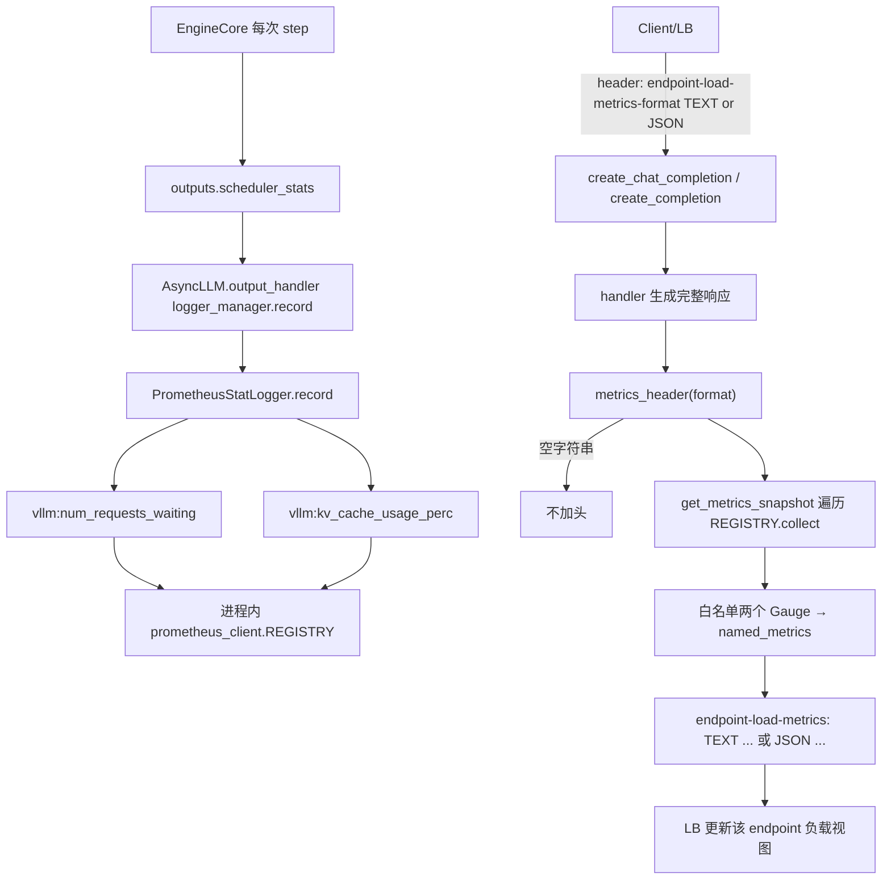

# 06 · vLLM ORCA 反压：`endpoint-load-metrics`

对照 `third_party/vllm` @ `2c7d7dd64a2eaba0feedf42cab2f527486d7479c`。

本篇**不谈 tokenizer**。它是 [02-vllm.md](02-vllm.md) 刻意跳过的那一层：调度器状态怎么变成 HTTP 响应头，给上游 LB 做 least-load。跟 Renderer / Detokenizer 无关；头是在 handler 已经生成完整 `ChatCompletionResponse` 之后才贴上去的。

协议背景：

- [ORCA load report 头格式](https://docs.google.com/document/d/1C1ybMmDKJIVlrbOLbywhu9iRYo4rilR-cT50OTtOFTs/edit?tab=t.0)
- [xDS `OrcaLoadReport` proto](https://github.com/cncf/xds/blob/main/xds/data/orca/v3/orca_load_report.proto)

消费端常见于 gateway-api-inference-extension / Envoy：按 `named_metrics` 更新该 endpoint 的负载视图，影响**下一个**请求的选点。vLLM 自己不做任何限流决策。

## 该打开的文件

| 角色 | 路径 |
| --- | --- |
| 引擎 step → logger | `vllm/v1/engine/async_llm.py` |
| Gauge 注册与 `.set()` | `vllm/v1/metrics/loggers.py` `PrometheusStatLogger` |
| 进程内快照 | `vllm/v1/metrics/reader.py` `get_metrics_snapshot` |
| `/metrics` 用的 registry | `vllm/v1/metrics/prometheus.py` `get_prometheus_registry` |
| 按 engine 打 label | `vllm/v1/metrics/utils.py` `create_metric_per_engine` |
| 调度器字段语义 | `vllm/v1/metrics/stats.py` `SchedulerStats` |
| ORCA 头序列化 | `vllm/entrypoints/serve/utils/orca_metrics.py` |
| Chat 入口 | `vllm/entrypoints/openai/chat_completion/api_router.py` |
| Completion 入口 | `vllm/entrypoints/openai/completion/api_router.py` |
| 另一套并发计数 | `vllm/entrypoints/serve/utils/api_utils.py` `@load_aware_call` |
| `/load` | `vllm/entrypoints/serve/instrumentator/basic.py` |
| `/metrics` | `vllm/entrypoints/serve/instrumentator/metrics.py` |
| 对照测试 | `tests/entrypoints/serve/instrumentator/test_orca_metrics.py` |

---

## 1. 一句话定位

ORCA 反压链路做的事是：**引擎每一步把调度器状态写进进程内的 Prometheus Gauge，请求返回时同步读一次快照，把 KV cache 占用和排队数塞进响应头，让上游 LB 按最新负载选下一跳。** 全链路只有一个可选 header 做开关。

```
写：EngineCore.scheduler_stats → Prometheus Gauge（持续）
读：请求头 endpoint-load-metrics-format → 响应头 endpoint-load-metrics（按需）
```

---

## 2. 端到端链路



### 2.1 引擎侧：持续写

`output_handler` 每个 engine 输出都 `record` 一次。`scheduler_stats` 是调度器这一步的快照，不是 HTTP 层数出来的。

```734:742:third_party/vllm/vllm/v1/engine/async_llm.py
                    # 4) Logging.
                    # TODO(rob): make into a coroutine and launch it in
                    # background thread once Prometheus overhead is non-trivial.
                    if logger_ref[0]:
                        logger_ref[0].record(
                            engine_idx=outputs.engine_index,
                            scheduler_stats=outputs.scheduler_stats,
                            iteration_stats=iteration_stats,
                            mm_cache_stats=renderer.stat_mm_cache(),
```

`StatLoggerManager` 默认总会挂一个 `PrometheusStatLogger`（除非调用方自己塞了自定义 Prometheus logger）。`--disable-log-stats` 时整个 `logger_manager` 是 `None`，Gauge 不会被更新。

```1108:1123:third_party/vllm/vllm/v1/metrics/loggers.py
        if scheduler_stats is not None:
            self.gauge_scheduler_running[engine_idx].set(
                scheduler_stats.num_running_reqs
            )
            total_waiting = (
                scheduler_stats.num_waiting_reqs
                + scheduler_stats.num_skipped_waiting_reqs
            )
            self.gauge_scheduler_waiting[engine_idx].set(total_waiting)
            self.gauge_waiting_by_reason[WAITING_REASON_CAPACITY][engine_idx].set(
                scheduler_stats.num_waiting_reqs
            )
            self.gauge_waiting_by_reason[WAITING_REASON_DEFERRED][engine_idx].set(
                scheduler_stats.num_skipped_waiting_reqs
            )
            self.gauge_kv_cache_usage[engine_idx].set(scheduler_stats.kv_cache_usage)
```

注册名就是后面 ORCA 白名单要找的两个 Prometheus 名。label 是 `model_name` + `engine`（DP 下一个 name 多条 sample）：

```503:511:third_party/vllm/vllm/v1/metrics/loggers.py
        gauge_scheduler_waiting = self._gauge_cls(
            name="vllm:num_requests_waiting",
            documentation="Number of requests waiting to be processed.",
            multiprocess_mode="mostrecent",
            labelnames=labelnames,
        )
        self.gauge_scheduler_waiting = create_metric_per_engine(
            gauge_scheduler_waiting, per_engine_labelvalues
        )
```

```561:569:third_party/vllm/vllm/v1/metrics/loggers.py
        gauge_kv_cache_usage = self._gauge_cls(
            name="vllm:kv_cache_usage_perc",
            documentation="KV-cache usage. 1 means 100 percent usage.",
            multiprocess_mode="mostrecent",
            labelnames=labelnames,
        )
        self.gauge_kv_cache_usage = create_metric_per_engine(
            gauge_kv_cache_usage, per_engine_labelvalues
        )
```

### 2.2 请求侧：按需读

开关是请求头 `endpoint-load-metrics-format`，缺省 `""`。只在**非流式** `JSONResponse` 上把返回值当 `headers=` 传进去。

```54:80:third_party/vllm/vllm/entrypoints/openai/chat_completion/api_router.py
async def create_chat_completion(request: ChatCompletionRequest, raw_request: Request):
    metrics_header_format = raw_request.headers.get(
        ENDPOINT_LOAD_METRICS_FORMAT_HEADER_LABEL, ""
    )
    handler = chat(raw_request)
    if handler is None:
        raise NotImplementedError("The model does not support Chat Completions API")

    generator = await handler.create_chat_completion(request, raw_request)

    if isinstance(generator, ErrorResponse):
        return JSONResponse(
            content=generator.model_dump(), status_code=generator.error.code
        )

    elif isinstance(generator, ChatCompletionResponse):
        return JSONResponse(
            content=generator.model_dump(),
            headers=metrics_header(metrics_header_format),
        )

    args = getattr(raw_request.app.state, "args", None)
    keep_alive_interval = getattr(args, "sse_keep_alive_interval", 0)
    return StreamingResponse(
        content=with_sse_keep_alive(generator, float(keep_alive_interval)),
        media_type="text/event-stream",
    )
```

`/v1/completions` 是同一套实现，常量各自定义一份：

```47:72:third_party/vllm/vllm/entrypoints/openai/completion/api_router.py
async def create_completion(request: CompletionRequest, raw_request: Request):
    metrics_header_format = raw_request.headers.get(
        ENDPOINT_LOAD_METRICS_FORMAT_HEADER_LABEL, ""
    )
    handler = completion(raw_request)
    if handler is None:
        raise NotImplementedError("The model does not support Completions API")

    generator = await handler.create_completion(request, raw_request)

    if isinstance(generator, ErrorResponse):
        return JSONResponse(
            content=generator.model_dump(), status_code=generator.error.code
        )
    elif isinstance(generator, CompletionResponse):
        return JSONResponse(
            content=generator.model_dump(),
            headers=metrics_header(metrics_header_format),
        )

    args = getattr(raw_request.app.state, "args", None)
    keep_alive_interval = getattr(args, "sse_keep_alive_interval", 0)
    return StreamingResponse(
        content=with_sse_keep_alive(generator, float(keep_alive_interval)),
        media_type="text/event-stream",
    )
```

`metrics_header("")` 直接 `None`，FastAPI 不加这个头。否则：`REGISTRY.collect()` → 白名单两个 Gauge → `TEXT` / `JSON` 序列化。

```116:120:third_party/vllm/vllm/entrypoints/serve/utils/orca_metrics.py
    if not metrics_format:
        return None
    # Get named metrics from prometheus.
    named_metrics = get_named_metrics_from_prometheus()
    return create_orca_header(metrics_format, named_metrics)
```

```86:96:third_party/vllm/vllm/entrypoints/serve/utils/orca_metrics.py
    prometheus_to_orca_metrics = {
        "vllm:kv_cache_usage_perc": "kv_cache_usage_perc",
        "vllm:num_requests_waiting": "num_requests_waiting",
    }
    metrics = get_metrics_snapshot()
    for metric in metrics:
        orca_name = prometheus_to_orca_metrics.get(metric.name)
        # If this metric is mapped into ORCA, then add it to the report.
        # Note: Only Gauge metrics are currently supported.
        if orca_name is not None and isinstance(metric, Gauge):
            named_metrics.append((str(orca_name), float(metric.value)))
```

快照遍历的是全局 `REGISTRY`，不是 `/metrics` 那个可能带 `MultiProcessCollector` 的 registry：

```86:95:third_party/vllm/vllm/v1/metrics/reader.py
    collected: list[Metric] = []
    for metric in REGISTRY.collect():
        if not metric.name.startswith("vllm:"):
            continue
        if metric.type == "gauge":
            samples = _get_samples(metric)
            for s in samples:
                collected.append(
                    Gauge(name=metric.name, labels=s.labels, value=s.value)
                )
```

```46:52:third_party/vllm/vllm/v1/metrics/prometheus.py
    if os.getenv("PROMETHEUS_MULTIPROC_DIR") is not None:
        logger.debug("Using multiprocess registry for prometheus metrics")
        registry = CollectorRegistry()
        multiprocess.MultiProcessCollector(registry)
        return registry

    return REGISTRY
```

头的两种样子（注释里的 `kv_cache_utilization` 是过时例子，真实字段是 `kv_cache_usage_perc`）：

```text
endpoint-load-metrics: TEXT named_metrics.kv_cache_usage_perc=0.4, named_metrics.num_requests_waiting=3.0
endpoint-load-metrics: JSON {"named_metrics": {"kv_cache_usage_perc": 0.4, "num_requests_waiting": 3.0}}
```

---

## 3. 两个指标的语义

来源是 `SchedulerStats`，不是 QPS、不是延迟。

```189:198:third_party/vllm/vllm/v1/metrics/stats.py
    num_running_reqs: int = 0

    num_waiting_reqs: int = 0  # length of the "waiting" request queue
    num_skipped_waiting_reqs: int = 0  # length of the "skipped waiting" queue

    # These are used for internal DP load-balancing.
    step_counter: int = 0
    current_wave: int = 0

    kv_cache_usage: float = 0.0
```

| ORCA 名 | Prometheus 名 | 值 | 含义 |
| --- | --- | --- | --- |
| `kv_cache_usage_perc` | `vllm:kv_cache_usage_perc` | 0~1 | GPU KV cache 占用率。文档写明 `1 means 100 percent usage`。接近 1 时新请求会排队或抢占。 |
| `num_requests_waiting` | `vllm:num_requests_waiting` | 计数 | **容量等待 + 被跳过** 的合计：`num_waiting_reqs + num_skipped_waiting_reqs`。后者是 LoRA budget / KV transfer / blocked 这类临时约束（`vllm:num_requests_waiting_by_reason` 的 `deferred`）。 |

选这两个而不是 QPS/延迟，是因为 LLM 请求代价方差极大（prompt 长度、生成长度差几个数量级）。队列长度 + 缓存水位比「刚处理了多少请求」更能预测「再压一个进来会不会变慢」。

细粒度原因拆分（`capacity` / `deferred`）**没有**进 ORCA 白名单，LB 只看到合计。

---

## 4. 值得注意的实现边界

- **只覆盖非流式。** `StreamingResponse` 没传 `headers=`，SSE 拿不到这个头。`/v1/chat/completions/batch` 连 `metrics_header` 都没调。生产里最常用的流式路径反而没有反压信号。
- **读的是全局 `REGISTRY`，不是 `/metrics` 的多进程聚合 registry。** 多 API server（`api_server_count > 1`，且设置了 `PROMETHEUS_MULTIPROC_DIR`）时，头里是**当前进程**自己 `record()` 进去的那份；`/metrics` 走 `get_prometheus_registry()`，口径可以不一致。
- **labels 被丢弃。** `get_metrics_snapshot` 对每个 sample 生成一个带 `labels` 的 `Gauge`。DP 下同名指标会有多条。ORCA 侧只取 `(name, value)`：TEXT 会输出重复的 `named_metrics.kv_cache_usage_perc=`；JSON 用 dict 推导，后者覆盖前者。等于隐式取了某个 engine 的值，不是聚合值。`AggregatedLoggingStatLogger`（`aggregate_engine_logging=True`）会把各 engine 的 `kv_cache_usage` **求平均**（`loggers.py` `aggregate_scheduler_stats`），ORCA 没有走那条路。
- **每请求一次全量 `REGISTRY.collect()`**，成功时还打一条 `logger.info`（`orca_metrics.py:68`）。`collect()` 会遍历所有 vLLM 指标（含 histogram 桶展开）。这是默认关闭、靠 header 逐请求开启的原因。
- **格式非法静默降级。** 不是 `text`/`json`（大小写不敏感）只 warning 然后 `None`，客户端拿不到头也不会 4xx。顺带：warning 传的是内置函数 `format` 而不是 `metrics_format`，日志会打成 `<built-in function format>`。

```36:41:third_party/vllm/vllm/entrypoints/serve/utils/orca_metrics.py
    if metrics_format.lower() not in ["text", "json"]:
        logger.warning(
            "Warning: `%s` format is not supported in the ORCA response header",
            format,
        )
        return None
```

- **`--disable-log-stats`：** `AsyncLLM.logger_manager` 为 `None`，Gauge 不更新。请求仍可带 format 头，结果往往是空的 `named_metrics`（`TEXT ` 或 `JSON {"named_metrics": {}}`），不是错误。
- **和 `@load_aware_call` / `/load` 是另一套机制。** `enable_server_load_tracking`（CLI `--enable-server-load-tracking`）在 `app.state.server_load_metrics` 上做**在途请求计数**：进 handler `+1`，响应 `background` 任务在流式真正发完后 `-1`。`GET /load` 返回这个整数。它不读 Prometheus，也不参与 ORCA 头。

```110:117:third_party/vllm/vllm/entrypoints/serve/utils/api_utils.py
        if not getattr(raw_request.app.state, "enable_server_load_tracking", False):
            return await func(*args, **kwargs)

        # ensure the counter exists
        if not hasattr(raw_request.app.state, "server_load_metrics"):
            raw_request.app.state.server_load_metrics = 0

        raw_request.app.state.server_load_metrics += 1
```

| 机制 | 开关 | 数据 | 出口 | 流式 |
| --- | --- | --- | --- | --- |
| ORCA 头 | 请求头 `endpoint-load-metrics-format` | KV 占用 + 排队（Prometheus Gauge） | 响应头 `endpoint-load-metrics` | 无 |
| server load | `--enable-server-load-tracking` | 本进程在途请求数 | `GET /load` | 有（background 减 1） |

---

## 5. 对照测试

[`tests/entrypoints/serve/instrumentator/test_orca_metrics.py`](../third_party/vllm/tests/entrypoints/serve/instrumentator/test_orca_metrics.py) 只断言头**存在**：

- chat：`endpoint-load-metrics-format: TEXT`
- completion：`JSON`

不校验数值、字段名、TEXT/JSON 语法，也不覆盖流式、非法 format、DP 多 sample、`--disable-log-stats`。

---

## 读完应能回答

1. 上游要看到反压信号，必须带哪个请求头？缺省会怎样？
2. 头里两个 named metric 分别对应调度器的哪几个字段？`num_requests_waiting` 含不含 deferred？
3. 为什么流式 Chat Completions 没有这个头？batch 呢？
4. ORCA 读的 registry 和 `/metrics` 是不是同一个？多 API server 时意味着什么？
5. DP 下 JSON 格式的 `kv_cache_usage_perc` 是聚合、平均，还是某一个 engine？
6. `@load_aware_call` 的 `server_load_metrics` 会不会写进 `endpoint-load-metrics`？
